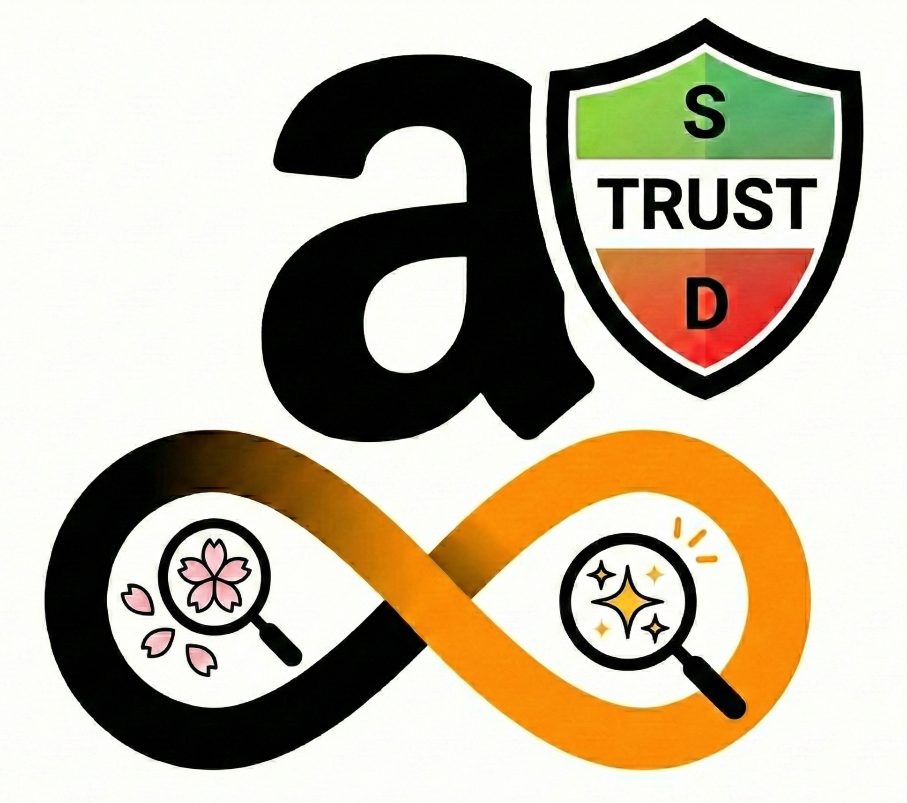

# 🛡️ Amazon Reviewer Trust Badge (レビュー信頼度判定 & サクラ検出)

  

**「その★5レビュー、本当に信用できますか？」**

Amazon Reviewer Trust Badgeは、**レビュアー（投稿者）の過去の活動履歴を徹底的に分析**し、その信頼度を可視化するブラウザ拡張機能（UserScript）です。
商品そのものではなく「誰が書いたか」に着目することで、サクラレビュー、組織票、バイアスのかかった評価を瞬時に見抜きます。

さらに、**無限スクロール**や**信頼度フィルタリング機能**を追加し、Amazonでのショッピング体験を劇的に快適にします。

## ✨ 主な機能

### 1. 信頼度スコアリングとバッジ表示

レビュアーの投稿履歴を解析し、信頼度を **S (最高)** 〜 **D (低品質/危険)** のランクで評価。名前の横にバッジとして表示します。

* **S/Aランク:** 詳細なレビューや写真投稿が多く、多くの人から感謝されている信頼できるレビュアー。
* **Dランク:** 全ての投稿が★5、内容が極端に薄い、不自然な投稿パターンのある疑わしいアカウント。

### 2. 詳細分析レポート

バッジをクリックすると、詳細な分析レポートがポップアップ表示されます。

* **評価分布グラフ:** その人が過去にどのような星をつけてきたかを可視化（全て★5などは一目瞭然）。
* **統計データ:** 平均文字数、写真投稿率、参考になった投票の獲得数。
* **警告タグ:** 「サクラ疑い」「VINE提供品（バイアスあり）」「未購入」などのリスク要因を表示。

### 3. 高機能フィルタリング & 無限スクロール

レビュー一覧ページに強力な機能を追加します。

* **信頼度フィルタ:** 「信頼度B以上のレビューのみ表示」といったフィルタリングが可能。サクラレビューを物理的に非表示にできます。
* **無限スクロール:** 次のページを自動で読み込み、シームレスに閲覧可能。

---

## 🏷️ 分析タグの意味

スクリプトはレビュアーの特徴を以下のタグで分類します。

| タグ | ラベル | 意味と傾向 |
| --- | --- | --- |
| **Div** | 🛡️ 自然分布 | 評価の分布が自然で、極端な偏りが見られない信頼できる傾向。 |
| **Deep** | 📝 長文詳細 | 文字数が多く、熱量の高い詳細なレビューを投稿する傾向。 |
| **Img** | 📷 写真あり | 実機確認の証拠となる写真を投稿しており、信頼性が高い。 |
| **Gold** | 🏅 高品質 | 他者からの評価（参考になった票）を継続的に得ているトップレビュアー。 |
| **All5** | 🚨 全件★5 | 投稿が全て★5。サクラ、または強いバイアスの可能性。 |
| **Thin** | 🍂 内容希薄 | 全体的に内容が薄く、情報価値が低い投稿。 |
| **Swarm** | 🐝 組織票疑 | 内容に対して不自然に多くの票が入っている（組織的な操作の疑い）。 |
| **Gap** | 📉 品質乖離 | 特定の商品だけ高評価し、他は適当に書いているなどの不自然な乖離。 |
| **Vine** | 🎁 Vine | 無償提供プログラムによるレビュー。好意的なバイアスがかかりやすい。 |
| **Non** | ⚠️ 未購入 | Amazonでの購入履歴がないレビュー。外部購入や架空レビューの可能性。 |

---

## 📥 インストール方法

このツールはPCブラウザ（Chrome, Edge, Firefox等）および一部のモバイルブラウザで動作するUserScriptです。

1. **拡張機能の導入**: 以下のいずれかの拡張機能をブラウザにインストールしてください。
* [Violentmonkey](https://violentmonkey.github.io/)
* [Tampermonkey](https://www.tampermonkey.net/)

2. **スクリプトのインストール**:
* [ここをクリックしてインストール](https://github.com/koyasi777/amazon-review-trust-badge/raw/main/amazon-review-trust-badge.user.js) （※GitHubのRawリンク等を設定）

3. **完了**: Amazonの商品ページを開くと、自動的に分析が始まります。

---

## 🧠 信頼度判定アルゴリズムについて

本スクリプトは、単なるテキストマッチングではなく、統計的な行動分析に基づいています。

### 加点要素 (+)

* **多様性:** 良い点・悪い点を公平に評価している（星のばらつきがある）。
* **情報量:** 平均文字数が多く、具体的である。
* **実績:** 他のユーザーから「参考になった」と評価されている。
* **実在証明:** 写真付きレビューの比率が高い。

### 減点要素 (-)

* **盲信的評価:** 投稿の100%が★5である（業者アカウントの特徴）。
* **内容の欠如:** 一言のみのレビューを量産している。
* **文脈の欠如:** 「Amazonで購入」ラベルがない（未購入）。
* **提供品バイアス:** Amazon Vine先取りプログラムによる提供品。

---

## ⚙️ 動作環境

* **対象サイト:** Amazon.co.jp (日本)
* **ブラウザ:** Chrome, Edge, Firefox, Safari (Userscript対応アプリ経由)
* **ページ:** 商品詳細ページ、レビュー一覧ページ、プロフィールページ

## ⚠️ 免責事項

* このスコアは独自のアルゴリズムに基づく推定値です。**Sランク＝絶対に正しい、Dランク＝絶対にサクラ、と断定するものではありません。** 最終的な判断はご自身で行ってください。
* Amazonの仕様変更により、予告なく動作しなくなる場合があります。
* 過度なリクエストを防ぐため、サーキットブレーカー（緊急停止機能）を搭載しています。

## 🤝 貢献とサポート

バグ報告や機能要望は [Issues](https://github.com/koyasi777/amazon-review-trust-badge/issues) までお願いします。プルリクエストも歓迎します。
